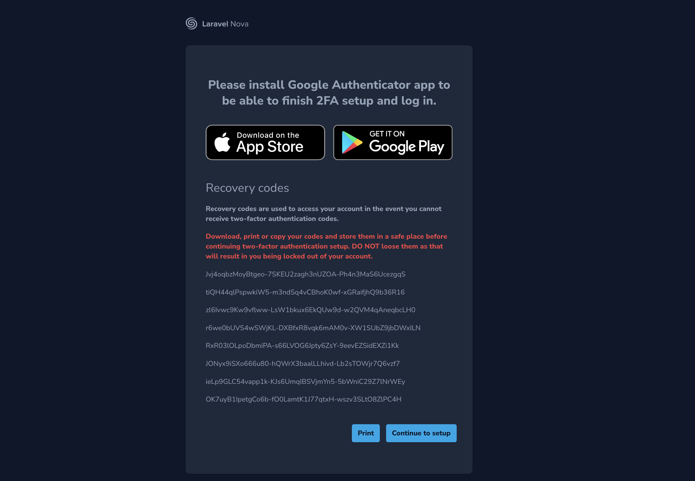
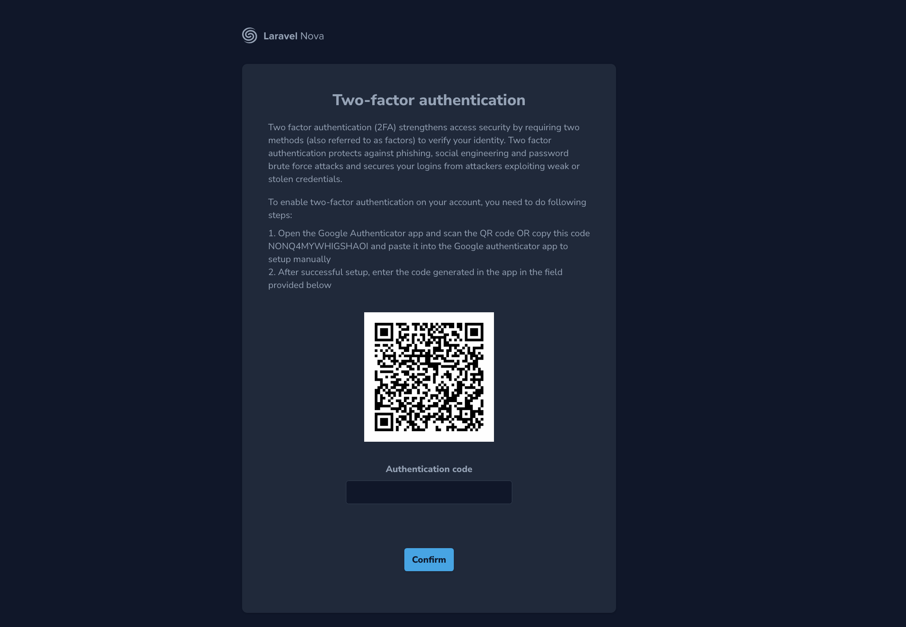
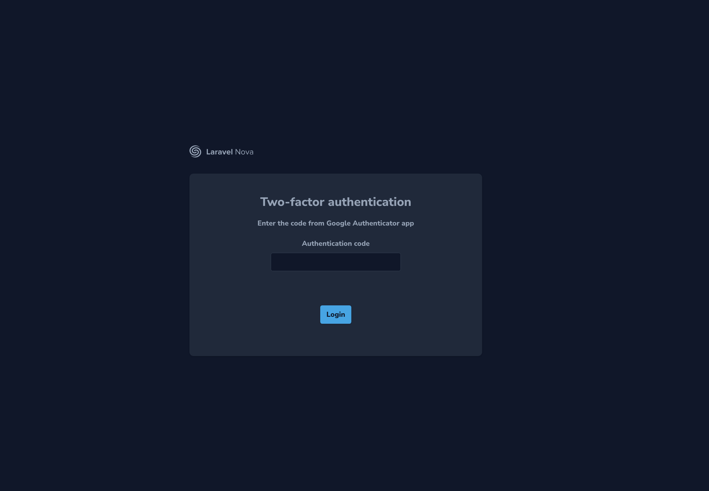
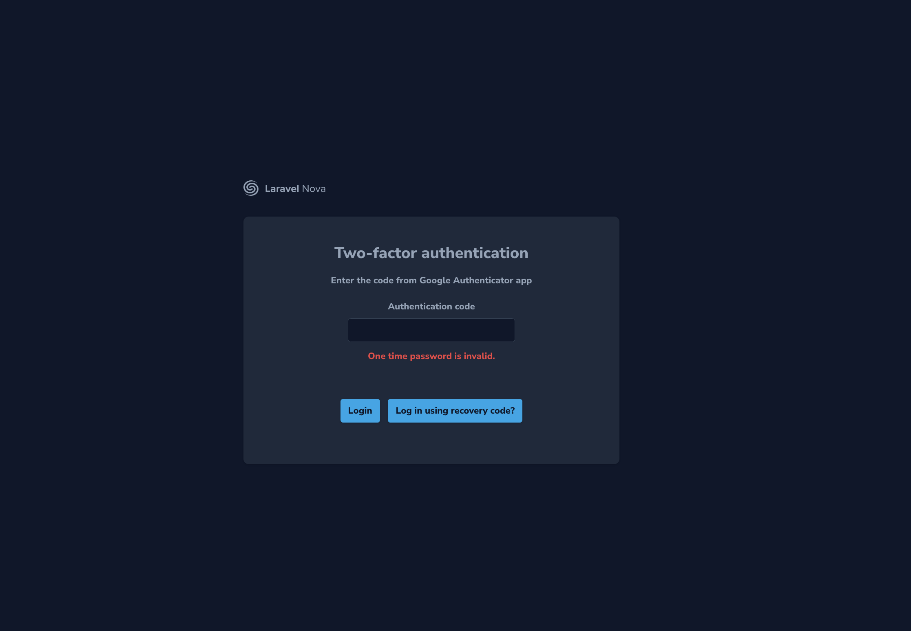
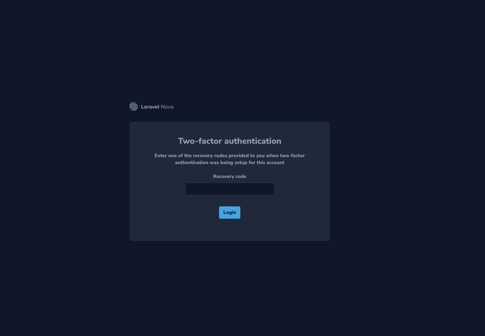
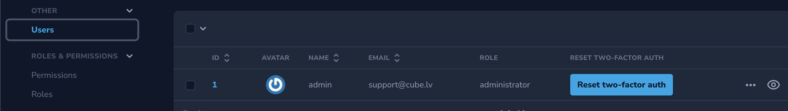

## cube-agency/nova-google2fa

This package enforces 2FA for Laravel Nova.

## Flow

### Activation

- User gets recovery codes.



- User activates 2FA on his device.



### Verification

- User verifies login with 2FA.



### Recovery

- If user enters invalid code, recovery button is shown.



- User enters recovery code.



- User is logged in and can choose to reset two-factor auth via their Nova user resource.



- Add ability for User to reset their two-factor auth

```php
     Text::make('Reset two-factor auth', function () {
                if (auth()->id() === $this->id) {
                    $route = route('nova.google2fa.destroy');
                    $buttonText = __('nova-google2fa::2fa-auth.actions.reset');

                    return "<a href='{$route}' class='class=shadow relative bg-primary-500 hover:bg-primary-400 text-white dark:text-gray-900 cursor-pointer rounded text-sm font-bold focus:outline-none focus:ring ring-primary-200 dark:ring-gray-600 inline-flex items-center justify-center h-9 px-3 shadow relative bg-primary-500 hover:bg-primary-400 text-white dark:text-gray-900'>
                            {$buttonText}</a>";
                }
            })->asHtml(),
```

## Installation

Install via composer

``` bash
$ composer require cube-agency/nova-google2fa
```

Publish config and migrations

``` bash
$ php artisan vendor:publish --provider="CubeAgency\NovaGoogle2fa\ToolServiceProvider"
```

Run migrations

> Note: Make sure you adjust config values according to your project before running migrations to avoid errors.

``` bash
$ php artisan migrate
```


Use trait ```use CubeAgency\NovaGoogle2fa\Traits\HasGoogle2fa;``` within your User model to add 2FA relation

or

Add relation to User model manually
```php
use CubeAgency\NovaGoogle2fa\Models\User2fa;

...

/**
 * @return HasOne
 */
public function user2fa(): HasOne
{
    return $this->hasOne(User2fa::class);
}
```

Add middleware to `nova.config`.
```php
[
    ...
    'middleware' => [
        ...
        \CubeAgency\NovaGoogle2fa\Http\Middleware\Google2fa::class,
        ...
    ],
]
```

## Config

```php
return [
    /**
     * Disable or enable middleware.
     */
    'enabled' => env('GOOGLE_2FA_ENABLED', true),

    'models' => [
        /**
         * Change this variable to path to user model.
         */
        'user'    => 'App\User',

        /**
         * Change this if you need a custom connector
         */
        'user2fa' => User2fa::class,
    ],
    'tables' => [
        /**
         * Table in which users are stored.
         */
        'user' => 'users',
    ],

    'recovery_codes' => [
        /**
         * Number of recovery codes that will be generated.
         */
        'count'             => 8,

        /**
         * Number of blocks in each recovery code.
         */
        'blocks'            => 3,

        /**
         * Number of characters in each block in recovery code.
         */
        'chars_in_block'    => 16,
    ],

    'recovery_input' => 'recovery_code',

    'app_store_links' => [
        'android' => 'https://play.google.com/store/apps/details?id=com.google.android.apps.authenticator2&hl=en&gl=US',
        'ios' => 'https://apps.apple.com/lv/app/google-authenticator/id388497605',
    ]
];
```
